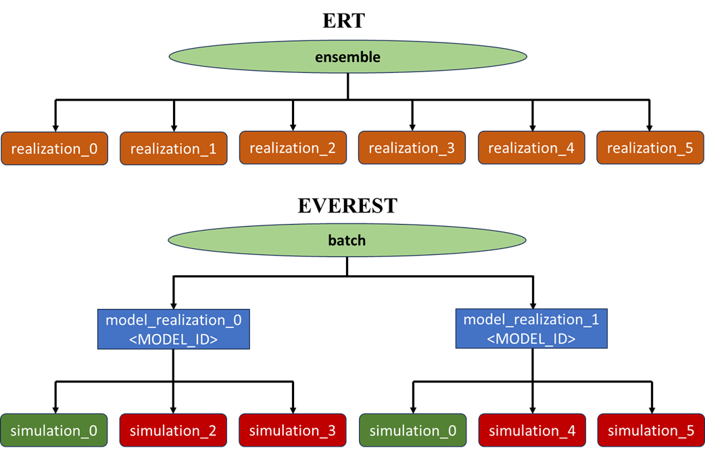
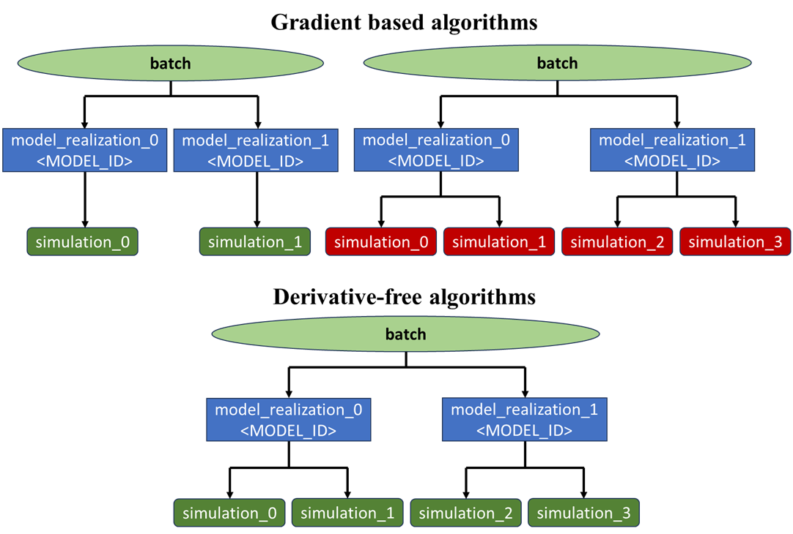

.. _cha_development:

***********
Development
***********

In this section Everest development decisions are documented.

Architecture
============

The everest application is split into two components, a server component and a
client component.

.. figure:: images/architecture_design.png
    :align: center
    :width: 700px
    :alt: Everest architecture

    Everest architecture

Every time an optimization instance is ran by a user, the client component of the
application spawns an instance of the server component, which is started either on a
cluster node using LSF (when the `queue_system` is defined to be *lsf*) or on the
client's machine (when the `queue_system` is defined to be *local*).

Communication between the two components is done via an HTTP API.

Server HTTP API
===============
The Everest server component supports the following HTTP requests API. The Everest
server component was designed as an internal component that will be available as
long as the optimization process is running.

.. list-table:: Server HTTP API
   :widths: 25 25 75
   :header-rows: 1

   * - Method
     - Endpoint
     - Description
   * - GET
     - '/'
     - Check server is online
   * - GET
     - '/sim_progress'
     - Simulation progress information
   * - GET
     - '/opt_progress'
     - Optimization progress information
   * - POST
     - '/stop'
     - Signal everest optimization run termination. It will be called by the client when the optimization needs to be terminated in the middle of the run

EVEREST vs. ERT data models
===========================
EVEREST uses ERT for running an experiment. Whenver an EVEREST `experiment` is ran, `everserver` creates an `EverestRunModel` based on the
`ErtConfig` (obtained from `EverestConfig`). The `ErtConfig` requires an `EnsembleConfig` where EVEREST `objectives`
and `constraints` are mapped to ERT `responses` using `GenDataConfig` (stored in `EnsembleConfig.response_config`).
In `everest_to_ert_config` all the EVEREST `controls` are mapped to ERT `parameters` using `ExtParamConfig`
(stored in `EnsembleConfig.parameter_configs`). Then in `EverestRunModel._forward_model_evaluator` (used as evaluator
by the external optimization library `ropt`) a local storage is created for the `batch` (i.e., `ensemble`),
linked to the current `experiment`, and setup up `simulations` for all sets of `controls`.

All the forward models in the `batch` are then evaluated in ERT using `EverestRunModel._evaluate_and_postprocess`
(and in turn `BaseRunModel.run_workflows`) which uses the `EnsembleEvaluator` for execution. After ERT writes
to `simulation_results` and stores results in the `LocalEnsemble` (i.e., storage)
these results are then gathered in the forward model evaluator (called by `ropt`) and feedforward into the optimizer using
`EverestRunModel._gather_simulation_results` (i.e., reading the `.parquet` files generated by ERT). Every set of
forward model executions for a single set of inputs (`controls`) and outputs (`objectives` / `constraints`)
constitutes an ERT `realization` in the ERT queue system; denoted in EVEREST as a `simulation`.

There is a distinction between `unperturbed controls` (i.e., current `objective function` value) and
`perturbed controls` (i.e., required to calculate the `gradient`).
Furthermore, when performing robust optimization (i.e., multiple static `realizations`) a `batch` contains a
certain number of `realizations` (denoted by `<GEO_ID>`) and each `realization` contains a number of `simulations`
(i.e., forward model runs). These `simulations` are forward model runs for either `unperturbed controls` and/or
`perturbed controls`. This is the key differences between the hierarchical data model of EVEREST and ERT (Fig 3).
NOTE: `<GEO_ID>` is inserted in `everest_to_ert._extract_environment` and substituted in `ert.substitutions.substitute_real_iter` for all of the `run_paths`.

    Difference between `ensemble` in ERT and `batch` in EVEREST.

.. figure:: images/Everest_vs_Ert_02.png
    :align: center
    :width: 700px
    :alt: Additional explanation of Fig 3

    Different meaning of `realization` and `simulation`.

The mapping from data models in EVEREST and ERT is done in the `ropt` library, it maps from `realization` (ERT) to `<GEO_ID>` and `pertubation` (EVEREST) and vice versa.
`Batches` in EVEREST can contain several different configurations depending on the algorithm used. Gradient-based algorithms can have a single function
evaluation (`unperturbed controls`) per `<GEO_ID>`, a set of `perturbed controls` per `<GEO_ID>` to evaluate the gradient, or both.
Derivative-free methods can have several function evaluations per `<GEO_ID>` and no `perturbed controls`.
**NOTE:** the optimizer may decide that some `<GEO_ID>` are not needed, these are then skipped and the mapping from `ropt`
should reflect this (i.e., less `<GEO_ID>` in the batch results than expected).

    Three other possible configurations of EVEREST `batches` in the context of gradient-based (i.e., `optpp_q_newton`)
    and gradient-free (i.e., **WHICH ONE DO WE SUPPORT?**) optimization algorithms.
